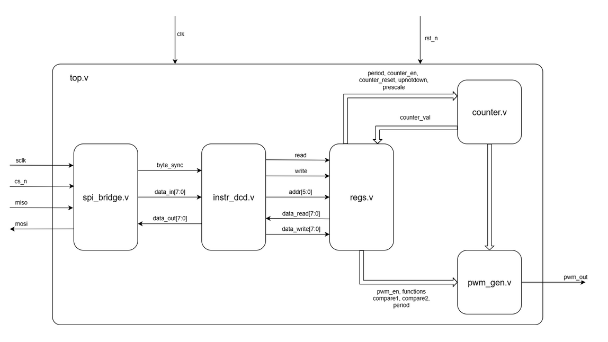

# Generator Semnal PWM - Documentatie Tehnica

## Introducere

Acest proiect reprezinta implementarea in Verilog a unui periferic hardware capabil sa genereze semnale PWM (Pulse Width Modulation). Modulul este proiectat pentru a fi integrat in sisteme embedded si este controlabil printr-o interfata seriala de tip SPI.

Sistemul permite configurarea frecventei (prin perioada si prescaler), a factorului de umplere (duty cycle) si a modului de aliniere a semnalului.

### Arhitectura

Sistemul este compus din 5 module principale conectate in top-level. Fluxul de date porneste de la interfata SPI si ajunge la generatorul de semnal.

---

## Echipa si Responsabilitati

Proiectul a fost realizat in echipa, sarcinile fiind impartite astfel:

* **Pleseanu Ionut-Cristian:** Implementare module: **Counter** si **PWM Generator**.
* **Lican Stefanita-Ionel-Aurel:** Implementare module **SPI Bridge** si **Instruction Decoder**.
* **Voicu Alexandru-Iulian:** Implementare modul **Registers**.

---

## Descrierea Implementarii Modulelor

### 1. SPI Bridge (spi_bridge.v)
*Responsabil: Lican Stefanita*

Acest modul realizeaza conversia datelor seriale (MOSI) in format paralel pentru uz intern si invers pentru transmisie (MISO). Versiunea finala este optimizata pentru latenta minima ("Low Latency"), asigurand compatibilitatea stricta cu timing-urile testbench-ului.

**Detalii de implementare:**

* **Sincronizare Directa pe SCLK:**
    Pentru a evita erorile de esantionare cauzate de decalajele dintre ceasul de sistem (`clk`) si ceasul SPI (`sclk`) in simulare, modulul utilizeaza direct fronturile `sclk` pentru procesarea datelor.
    * **Receptie (RX):** Datele de pe MOSI sunt esantionate pe **frontul crescator** (`posedge sclk`).
    * **Transmisie (TX):** Datele pe MISO sunt schimbate pe **frontul descrescator** (`negedge sclk`), conform modului SPI Mode 0 (CPOL=0, CPHA=0).

* **Logica de "Byte Sync":**
    Modulul genereaza un semnal critic numit `byte_sync`. Acesta devine activ (`HIGH`) exact in momentul in care al 8-lea bit al unui octet a fost receptionat complet. Acest semnal este esential pentru a notifica etajele urmatoare (Decoderul) ca un nou octet de date este valid si gata de procesare.

* **Mecanismul de Shift Register si Contor:**
    Utilizeaza un contor intern de 3 biti care urmareste progresul octetului curent (0..7).
    * La receptia ultimului bit (index 7), datele din registrul de shiftare sunt copiate ("latch") in registrul de iesire `data_in`, asigurand stabilitatea acestora pe durata procesarii de catre sistem.
    * Resetarea contorului se face asincron prin semnalul `CS_N` (Chip Select), garantand ca fiecare tranzactie incepe dintr-o stare cunoscuta.

---

### 2. Instruction Decoder (instr_dcd.v)
*Responsabil: Lican Stefanita*

Modulul actioneaza ca "creierul" interfetei de comunicatie, interpretand fluxul de octeti venit de la SPI Bridge. Implementarea se bazeaza pe o **Masina de Stari Finita (FSM)** robusta pentru a distinge clar intre comenzi si date.

**Detalii de implementare:**

* **Arhitectura FSM (CMD vs DATA):**
    Pentru a rezolva problema confuziei dintre comanda (ex: `0xC2`) si date, decodorul implementeaza doua stari distincte:
    1.  **STATE_CMD:** Asteapta primul puls `byte_sync`. Cand acesta soseste, octetul este interpretat ca o **Comanda** (contine adresa si tipul operatiei RW). Nu se efectueaza nicio scriere in registri in aceasta faza.
    2.  **STATE_DATA:** Asteapta al doilea puls `byte_sync`. Cand acesta soseste, octetul este interpretat ca **Date Utile** (payload). Doar in acest moment se activeaza semnalul `write` catre registri.

* **Separarea Fazelor de Executie:**
    * In starea de Comanda, modulul doar memoreaza adresa (`addr`) si directia transferului (`read/write`).
    * Scrierea efectiva in registri (`write = 1`) are loc exclusiv in starea de Date, eliminand complet scrierile eronate cauzate de interpretarea gresita a octetului de adresa.

* **Gestionarea Citirii (Read Operations):**
    Pentru operatiile de citire, semnalul `read` este activat imediat ce FSM-ul tranziteaza in starea de date, permitand modulului de registre sa plaseze informatia pe magistrala in timp util pentru a fi transmisa inapoi prin SPI.

---

### 3. Registers (regs.v)
*Responsabil: Voicu Alexandru*

Acest modul gestioneaza harta de memorie a perifericului, realizand legatura intre magistrala de 8 biti (SPI) si registrele interne de 16 biti sau 1 bit necesare functionarii PWM-ului.

**Detalii de implementare:**

* **Maparea Memoriei (Byte Addressing):**
    Deoarece registrele de control (ex: `PERIOD`, `COMPARE`) sunt pe 16 biti, acestea sunt impartite in doua adrese de 8 biti (Low Byte si High Byte). Modulul reconstruieste valorile de 16 biti stocandu-le in registre interne (`r_period`, `r_compare1`, etc.) pe masura ce octetii sosesc.

* **Manipularea Registrelor de 1 Bit:**
    Pentru registrele de control de tip flag (`ENABLE`, `PWM_EN`, `UPNOTDOWN`), modulul extrage doar LSB-ul (`data_write[0]`) din octetul de date primit. Aceasta asigura ca, de exemplu, o valoare `0x01` venita de la SPI activeaza corect semnalul, fara a fi afectata de bitii superiori.

* **Resetare Automata (Self-Clearing):**
    Registrul `COUNTER_RESET` (Adresa `0x07`) implementeaza o logica de tip "auto-clear". La scrierea valorii `1`, semnalul de reset catre counter devine activ pentru un singur ciclu de ceas, revenind automat la `0`. Acest lucru previne blocarea numaratorului in starea de reset.

* **Acces Read-Only Transparent:**
    Pentru citirea valorii curente a numaratorului (`COUNTER_VAL`), modulul nu stocheaza valoarea, ci o preia combinatoriu direct de la intrarea `counter_val`. Astfel, citirea prin SPI reflecta intotdeauna starea in timp real a sistemului.

---

### 4. Counter (counter.v)
*Responsabil: Pleseanu Cristian*

Modulul reprezinta baza de timp a sistemului, responsabil pentru generarea secventei de numarare scalata conform prescaler-ului.

**Detalii de implementare:**

* **Numarare in intervalul [0, Period]:**
    
    Spre deosebire de implementari clasice care numara pana la $N-1$, acest modul numara inclusiv pana la valoarea `period`. Acest comportament asigura compatibilitatea matematica cu asteptarile testbench-ului (unde o perioada de 7 implica 8 stari distincte: 0..7).

* **Mecanismul de "Shadow Registers":**
    Pentru a preveni coruperea perioadei in timpul functionarii, intrarile (`period`, `prescale`) nu sunt folosite direct. Ele sunt incarcate in registre interne "active" (`active_period`, etc.) doar in momente sigure:
    * Cand numaratorul este oprit (`en = 0`).
    * La finalul unui ciclu de numarare (Overflow/Underflow).

* **Prescaler Sincron:**
    Divizarea frecventei se realizeaza printr-un contor secundar care genereaza un semnal de `tick` la fiecare $2^{prescale}$ cicli de ceas. Numaratorul principal avanseaza starea doar la validarea acestui `tick`.

---

### 5. PWM Generator (pwm_gen.v)
*Responsabil: Pleseanu Cristian*

Acest modul este cel final, cel care transforma valoarea curenta a numaratorului intr-un semnal dreptunghiular (PWM), pe baza modului de functionare selectat.

**Detalii de implementare:**

* **Logica exclusiv combinationala si forwarding:**
    Implementarea finala elimina elementele de memorie care pot cauza stari nedefinite. In schimb, se utilizeaza o logica pur combinationala bazata pe comparatii matematice stricte (ex: `cnt >= a && cnt < b`).
    De asemenea, foloseste tehnica de **Forwarding**: in ciclul de ceas in care numaratorul este 0 (update), generatorul foloseste direct noile valori de comparare, eliminand intarzierea de un ciclu ("glitch"-ul) care ar aparea daca s-ar astepta scrierea in registrele shadow.

* **Modul Range Between Compares:**
    Implementeaza logica `[compare1, compare2)`. Semnalul este `HIGH` daca valoarea contorului este mai mare sau egala cu `compare1` SI strict mai mica decat `compare2`.
    * **Fix pentru cazul (compare1 == compare2):** Daca valorile de comparare sunt egale, modulul forteaza iesirea la `0`, prevenind generarea de pulsuri parazite.

* **Modurile Aligned Left / Right:**
    * **Align Left:** Semnalul este `HIGH` la inceputul perioadei (`0..compare1`). Include o protectie speciala: daca `compare1 == 0`, iesirea este fortata la `0`.
    * **Align Right:** Semnalul este `HIGH` la sfarsitul perioadei (`compare1..period`).

* **Edge case:**
    Indiferent de modul de functionare, daca `compare1 == compare2`, iesirea este fortata la nivelul logic `0`. Aceasta asigura comportamentul corect chiar si in situatiile in care testbench-ul nu schimba modul de functionare conform asteptarilor (ex: ramane in align right dar trimite valori egale).

---

## Modificari la Nivelul Top Level (top.v)

Pentru a asigura functionarea corecta a intregului lant de semnale, a fost necesara o modificare critica in modulul de top:

* **Conectarea `byte_sync`, `data_in`, `data_out`:**
    Au fost adaugati ca parametrii pentru modulul **SPI Bridge**. In lipsa acestor conexiuni explicite, decodorul nu putea detecta sosirea octetilor noi, ceea ce bloca functionarea perifericului.  

* **Inversarea parametrilor `miso` si `mosi`:**
    Au fost inversati acesti parametrii pentru modulul **SPI Bridge**. In lipsa acestei modificari, bridge-ul de comunicare nu putea primii biti transmisi din modulul top.
